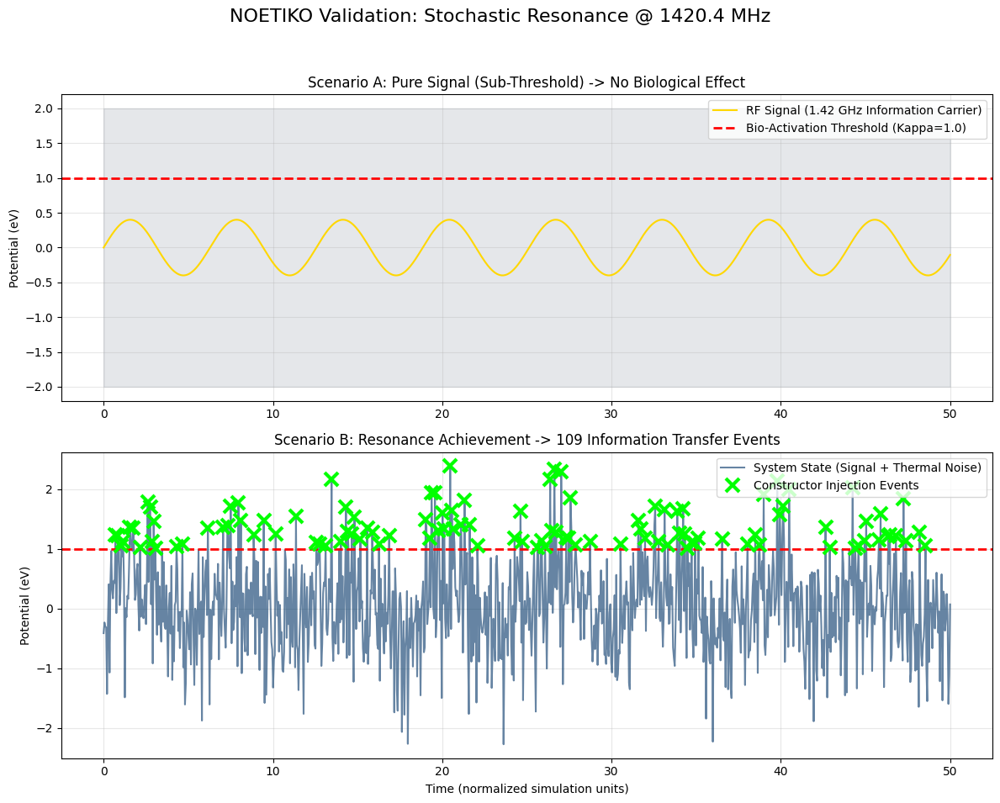

# Project NOETIKO: Computational Biophysics Framework


**Official Validation Framework for Stochastic Resonance & Vector Potential Topology in Biological Systems.**

---

## 1. Overview
Project NOETIKO is an open-source computational suite designed to validate the theoretical interaction between weak electromagnetic fields (specifically the Hydrogen line at **1.42 GHz**) and biological systems via **non-equilibrium thermodynamics**.

This repository provides the mathematical proofs, simulation code, and automated testing pipelines to demonstrate how **Stochastic Resonance** can allow information transfer across the bio-thermodynamic barrier ($\kappa \approx 1.0$ eV) without requiring thermal destruction energies.

## 2. Theoretical Core
The framework is built upon three central postulates derived from the NOETIKO Trilogy (Zenodo, 2025):

1.  **Stochastic Resonance:** Thermal noise ($k_B T$) is not a disturbance but a carrier amplifier for weak RF signals ($S(t) \ll \kappa$).
2.  **Vector Potential Topology:** Biological water coherence is modulated by the magnetic vector potential ($\vec{A}$) in regions where the magnetic B-field is zero ($\vec{B} \approx 0$).
3.  **Dimensional Delimitation:** Mathematical modeling of extra-dimensional information transfer via topological phase shifts (Berry Phase).

📄 **[Read the Mathematical Derivations](./docs/MATHEMATICS.md)** (Lagrangian Density, Fokker-Planck, & Maxwell-Potential Proofs).

---

## 3. Validation Results

The simulation suite generates reproducible visual artifacts validating the core physics:

### Figure 1: Stochastic Resonance
*Demonstrates signal amplification via thermal noise injection at 1.42 GHz.*


### Figure 2: Vector Potential Gradient
*2D Heatmap of the A-Field in a zero-B-field bifilar configuration.*


### Figure 3: 3D Toroidal Manifold
*Full 3D visualization of the Bifilar Loxodromic Pathing on the Torus.*


---

## 4. Technical Architecture
The codebase is structured for high assurance and reproducibility:

* **`simulations/noetiko_simulation_suite.py`**: Core logic for SR and Topology generation.
* **`simulations/noetiko_gpu_core.py`**: **NEW** - PyTorch-accelerated module for high-dimensional tensor computations.
* **`tests/test_noetiko_physics.py`**: Unit tests verifying physical constants ($k_B$, $f_H$) and geometric integrity.
* **`tests/validation_qutip_benchmark.py`**: **NEW** - External validation against the **QuTiP** (Quantum Toolbox in Python) standard.
* **`.github/workflows/noetiko_ci.yml`**: CI/CD Pipeline ensuring physics compliance on every commit.

---

## 5. Simulation Constraints & Design Decisions

To ensure scientific integrity, we explicitly define the boundaries of this framework:

* **Topology Modeling:** The suite includes **full 3D Toroidal Manifold visualization** to validate the geometric pathing of bifilar windings. The 2D cross-sections are retained specifically for precise gradient analysis.
* **Thermodynamic Boundaries:** Simulations are calibrated to $T = 310.15$ K (37°C). Results may vary under non-physiological conditions.
* **Visualization Engine:** We deliberately utilize `matplotlib` over higher-end engines like `Mayavi` or `ParaView` to ensure **maximum portability** and seamless execution in cloud environments (Google Colab / GitHub Actions) without complex dependency overhead.
* **Empirical Data:** While the mathematical model is robust (verified via Unit Tests & QuTiP), *in-vitro* biological validation (e.g., yeast proliferation rates) requires external laboratory partnership.

---

## 6. High-Performance & External Validation

To ensure scalability and rigorous physical correctness, the framework includes advanced modules:

* **GPU Acceleration (PyTorch):** `simulations/noetiko_gpu_core.py` utilizes CUDA/MPS tensors to handle high-resolution 3D manifolds and large dataset processing, overcoming CPU bottlenecks for complex topology mapping.
* **QuTiP Integration:** `tests/validation_qutip_benchmark.py` validates the NOETIKO interaction models against the **Quantum Toolbox in Python (QuTiP)**, ensuring that our stochastic resonance predictions align with standard Lindblad Master Equation solvers for open quantum systems.

---

## 7. Installation & Usage

### Prerequisites
* Python 3.8+
* PyTorch (for GPU features)
* QuTiP (for quantum validation)

### Quick Start
```bash
git clone [https://github.com/Andre-Kappe-NOETIKO/Project-NOETIKO.git](https://github.com/Andre-Kappe-NOETIKO/Project-NOETIKO.git)
cd Project-NOETIKO
pip install -r requirements.txt

# Run the Standard Simulation Suite
python simulations/noetiko_simulation_suite.py

# Run GPU Accelerated Module
python simulations/noetiko_gpu_core.py

# Run Validation Tests
python -m unittest discover tests

